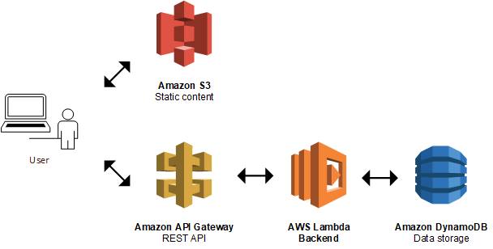

# Deployment Guide: AWS CloudFormation, S3, and API Gateway  




## 1. CloudFormation Stack  
- Navigate to **AWS CloudFormation** and create a new stack.  
- Upload the **YAML template** file. *(Optional: View in Designer)*  
- Click **Next**, acknowledge, and **Create Stack**.  
- Wait for stack creation to complete.  

## 2. S3 Bucket for Static Hosting  
- Create an **S3 bucket** named `item-frontend-static-hosting`.  
- **Enable Public Access** and **Static Website Hosting** (index.html as the index document).  


### **Update Bucket Policy**  
```json

{
    "Version": "2012-10-17",
    "Statement": [
        {
            "Sid": "PublicReadGetObject",
            "Effect": "Allow",
            "Principal": "*",
            "Action": "s3:GetObject",
            "Resource": "arn:aws:s3:::items-frontend-static-hosting/*"
        }
    ]
}
```

### **Edit bucket CORS configuration. Use the following code and save**
```json


[
    {
        "AllowedHeaders": [
            "*"
        ],
        "AllowedMethods": [
            "GET"
        ],
        "AllowedOrigins": [
            "*"
        ],
        "ExposeHeaders": []
    }
]

```


# API Gateway Configuration

Go to API Gateway section to check API created as part of CF stack. items-api is created
Need to copy Invoke URL to be configured in frontend config
Need to modify four things: Routes, Integrations, Stages, CORS and then Deploy
Click Stage on left navigation. Then Click Create
New stage name "prod". Click Create at bottom
Go to Integrations
Manage Integrations tab. A default integration exists but we click Create to create a new one
Specify integration type, AWS region and Lambda function. This Lambda function is also created as part of CF stack. Click Create at bottom
New integration is ready. Note integration ID
Now need to create 6 routes: /items (OPTIONS, GET, PUT) and /items/{id} (OPTIONS, DELETE, GET) :
  - GET /items
  - PUT /items
  -  GET /items/{id}
  -  DELETE(/items/{id}
   - OPTIONS /items
   - OPTIONS /items/{id}
Attach the NEW integration to the Lambda function to each of the 6 routes. Click Route. Then click Attach integration.
Select correct integration matching integration ID. Click Attach integration 
Repeat for all 6 routes
Configure CORS. All 6 fields should be configured:
    The bucket URL (for eu-west-3 buckets) should be: https://YOURBUCKETNAME.s3.amazonaws.com
    "Access-Control-Allow-Origin" has to be specified after creating the S3 bucket as its name is used in the URL. Click Save. 
Now click Deploy at top right and select prod Stage for deployment

* Invoke URL: https://koxyo8j6t6.execute-api.eu-west-3.amazonaws.com/Prod  

* Integration ID: koxyo8j6t6

# client-side code
in the config file configure the id of the integration

### Make sure Nodejs version 12.x is installed on local computer
npm install 
npm run build 
drop or upload  the the build (what's inside it ) in the s3 bucket u just created 
navigate to index.html file and get the link of your website 